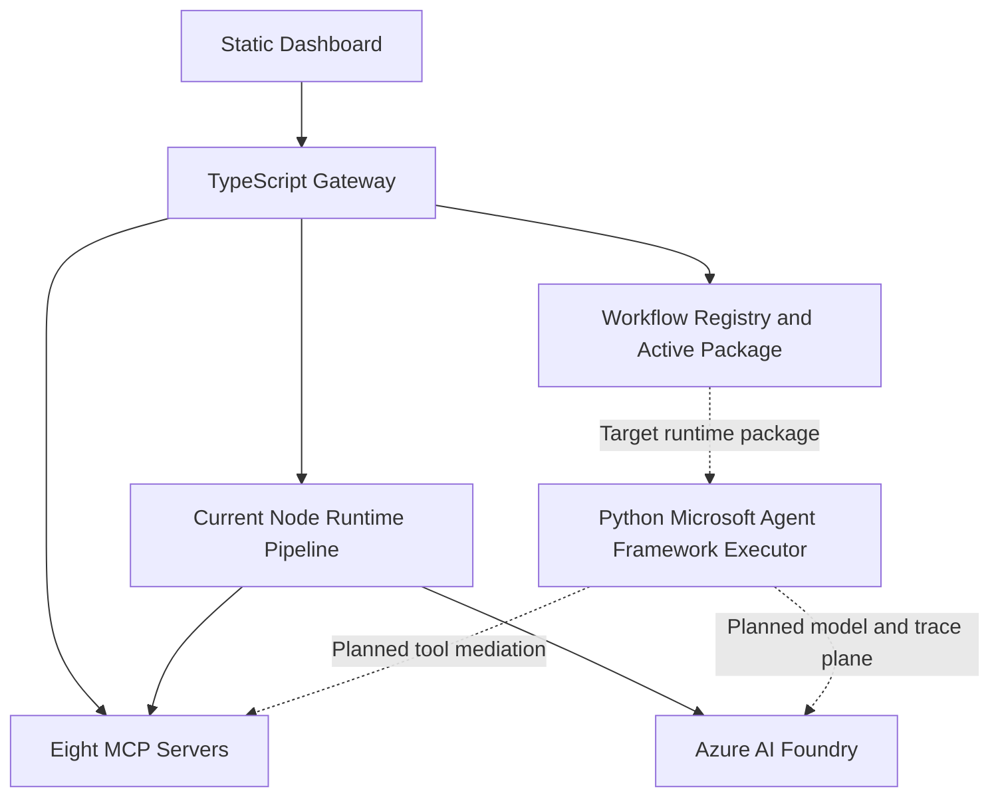
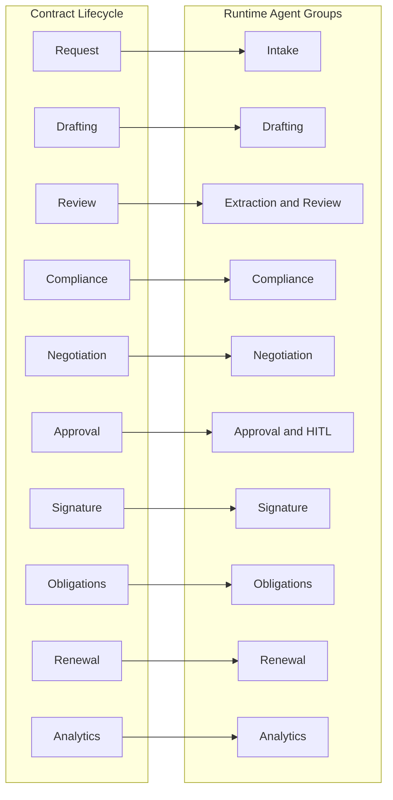
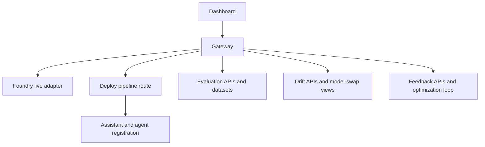

# Contract AgentOps Demo

## 1. Overview Of The Solution

Contract AgentOps Demo is a contract lifecycle management demo used to show how AgentOps practices can govern an AI-powered business workflow.

The solution keeps two lifecycles separate:

- Contract Lifecycle is the business process for agreements: request, drafting, review, compliance, negotiation, approval, signature, obligations, renewal, and analytics.
- AgentOps is the AI system lifecycle: design, test, deploy, run, monitor, evaluate, detect drift, and collect feedback.

That separation is the core architectural rule in this repo. The business workflow explains where the contract is. AgentOps explains how the AI system that supports that workflow is designed, validated, deployed, observed, and improved.

Today, the runnable application is a TypeScript and Node.js control plane:

- Static dashboard in `ui/`
- Fastify gateway in `gateway/`
- Eight MCP servers in `mcp-servers/`
- Contract-processing runtime pipeline for intake, extraction, review, compliance, negotiation, and approval
- Workflow designer and workflow-package activation endpoints
- Simulated mode and live Azure AI Foundry mode

The repo also includes a Microsoft Agent Framework track in `agents/microsoft-framework/`. That track is important to the target architecture, but it is not yet the primary execution path for the root application runtime.



## 2. Tech Stack And Purpose

| Layer | Technology | Purpose In This Solution |
|---|---|---|
| UI | Static HTML, CSS, JavaScript in `ui/` | Presents the AgentOps experience across Design, Test, Deploy, Live, Monitor, Evaluate, Drift, and Feedback |
| API gateway | Fastify on Node.js in `gateway/` | Serves the UI, exposes APIs, manages workflow packages, runs the current contract pipeline, and coordinates deployment |
| App language | TypeScript | Implements the gateway, orchestrator, route handlers, startup launcher, and agent workspace |
| Workspace orchestration | npm workspaces | Builds and runs the root app, gateway, agents workspace, and MCP servers as one repo |
| MCP integration | `@modelcontextprotocol/sdk` based servers | Encapsulates contract-domain tools behind bounded interfaces for intake, extraction, compliance, workflow, audit, evaluation, drift, and feedback |
| AI runtime today | Gateway adapters plus agent functions in `agents/src/` | Executes the current six-stage processing path using simulated or Foundry-backed calls |
| AI control plane | Azure AI Foundry and Azure OpenAI endpoints | Provides live model access, deployment targets, agent registration, evaluation signals, and enterprise AI hosting posture |
| Identity | `@azure/identity` and managed identity | Supports secure live-mode access to Foundry without embedding secrets in Azure-hosted runtime paths |
| Workflow authoring | Workflow registry in `gateway/src/services/workflowRegistry.ts` plus `config/stages/contract-lifecycle.json` | Stores operator-authored workflows, active packages, and stage-to-agent mappings |
| Declarative assets | `prompts/`, `config/agents/`, `config/schemas/`, `config/stages/` | Keeps prompts, agent configs, schemas, and lifecycle metadata reviewable and versioned |
| Data and demo assets | `data/` | Stores policies, contracts, evaluation results, drift data, feedback, workflow state, and simulated responses |
| Testing | Vitest plus TypeScript smoke tests in `tests/` | Verifies pipeline logic, evaluation logic, drift logic, feedback flows, and deployment smoke behavior |
| Infrastructure as code | Bicep in `infra/` | Provisions Azure resources for the App Service deployment path |
| Deployment orchestration | Azure Developer CLI via `azure.yaml` | Provisions and deploys the application to Azure App Service |
| CI/CD | GitHub Actions in `.github/workflows/` | Validates, builds, tests, provisions, deploys, and verifies the Azure-hosted application |

## 3. Microsoft Agent Framework And How It Fits Here

### Why MAF matters in this solution

Microsoft Agent Framework is the intended execution runtime for the long-term architecture because it gives the demo a credible enterprise agent orchestration story: workflows, tool mediation, human checkpoints, retries, and observability.

The important point is that MAF does not replace the business contract lifecycle. It executes the agents that implement business stages.

### Business stages vs runtime agents

The active contract stage catalog defines ten business stages:

1. Request and Initiation
2. Authoring and Drafting
3. Internal Review
4. Compliance Check
5. Negotiation and External Review
6. Approval Routing
7. Execution and Signature
8. Post-Execution Obligations
9. Renewal and Expiry
10. Lifecycle Analytics

Each of those stages can map to one or more runtime agents. That allows the demo to stay business-readable while still evolving into richer multi-agent execution groups.

### Agent types in the repo

| Agent Type | Current Role In Repo | Primary Tool Affinity |
|---|---|---|
| Intake | Classifies document type and extracts initial metadata | Intake MCP |
| Drafting | Declared in workflow assets and agent config for authoring-stage packaging | Extraction and workflow MCP |
| Extraction | Extracts clauses, parties, dates, and values | Extraction MCP |
| Review | Summarizes redlines and internal review outcomes | Audit MCP |
| Compliance | Checks extracted terms against policy rules | Compliance MCP |
| Negotiation | Recommends fallback positions for counterparty changes | Workflow MCP |
| Approval | Routes for approval and human escalation | Workflow MCP |
| Signature | Declared for execution-stage workflow packaging | Workflow and audit MCP |
| Obligations | Declared for post-signature obligation management | Workflow and audit MCP |
| Renewal | Declared for renewal and expiry analysis | Drift MCP |
| Analytics | Declared for lifecycle reporting and insight summarization | Evaluation MCP |

### How agents communicate

There are two communication models in this repo.

Current runtime path:

1. The gateway accepts a contract submission.
2. The current Node pipeline runs six processing steps in order: intake, extraction, review, compliance, negotiation, approval.
3. Each step uses an LLM adapter and bounded MCP tool set.
4. Audit events, traces, contract status, and WebSocket updates are emitted back to the UI.

Target MAF path:

1. The dashboard authors a workflow.
2. The gateway normalizes that definition into an active workflow package.
3. A Python MAF executor consumes the package.
4. Runtime stage groups call MCP tools and Foundry models under explicit control boundaries.
5. Business-stage progress remains visible separately from AgentOps telemetry.



### Current MAF utilization status

| Area | Status | Notes |
|---|---|---|
| MAF architectural direction | Implemented as the target architecture | Captured in ADR and SPEC |
| Python MAF sidecar track | Implemented as a separate workspace under `agents/microsoft-framework/` | Includes config, workflows, prompts, and demo scaffolding |
| Root runtime integration with MAF | Not yet primary execution path | Root app still runs through the Node gateway pipeline |
| Declarative assets for MAF-style runtime | Implemented | Agent YAML, schemas, prompts, stage catalog, workflow packages |
| Full end-to-end MAF executor as system of record for in-flight state | Not yet complete | Gateway is still the main runnable control plane |

Important nuance: the `agents/microsoft-framework/` track currently contains mock compatibility classes and demo scaffolding, so it should be treated as an implementation track toward the target runtime, not as the already-integrated production execution engine for the root app.

## 4. MCP Implementation

MCP is the business tool boundary in this solution. Instead of letting agents call arbitrary internal code, the repo exposes contract-domain capabilities through focused MCP servers.

### MCP server inventory

| MCP Server | Primary Responsibility | Example Tools |
|---|---|---|
| `contract-intake-mcp` | Contract intake and metadata registration | `upload_contract`, `classify_document`, `extract_metadata` |
| `contract-extraction-mcp` | Clause, party, date, and value extraction | `extract_clauses`, `identify_parties`, `extract_dates_values` |
| `contract-compliance-mcp` | Policy validation and risk flagging | `check_policy`, `flag_risk`, `get_policy_rules` |
| `contract-workflow-mcp` | Routing, escalation, and notifications | `route_approval`, `escalate_to_human`, `notify_stakeholder` |
| `contract-audit-mcp` | Audit trail and reporting | `log_decision`, `get_audit_trail`, `generate_report` |
| `contract-eval-mcp` | Evaluation runs and result retrieval | `run_evaluation`, `get_results`, `compare_baseline` |
| `contract-drift-mcp` | Drift and model-swap analysis | `detect_llm_drift`, `detect_data_drift`, `simulate_model_swap` |
| `contract-feedback-mcp` | Feedback submission and optimization loop | `submit_feedback`, `convert_to_tests`, `get_summary` |

### How MCP is used

- The root launcher starts all MCP servers first.
- The gateway checks MCP health before announcing readiness.
- The `/api/v1/tools` route exposes the current MCP registry.
- The gateway can call a specific MCP tool through `/api/v1/tools/:server/:tool`.
- Agents are configured with explicit MCP server affinity and tool lists.
- Workflow packages store tool bindings so the operator-authored design can be turned into a runtime-safe package.

### Why MCP is important here

MCP gives the demo clean boundaries for:

- auditability
- testability
- future MAF tool mediation
- swapping simulated and live runtime behaviors without rewriting business tools
- keeping domain operations separate from prompt logic

## 5. GenAIOps Implementation With Foundry

### What Foundry does in this repo

Azure AI Foundry is the live AI control plane for this demo. In live mode, the gateway uses Foundry-backed model calls and deployment registration flows. In simulated mode, the same business flow can run without Azure dependencies.

Today, the root runtime integrates with Foundry at the API, authentication, deployment, and operational-surface level. The repo does not yet rely on a single end-to-end Foundry SDK-centered runtime path for all orchestration.

### Foundry flow in the current app



### Implemented vs not yet implemented

| GenAIOps Concept | Status | What Exists In Repo |
|---|---|---|
| Live vs simulated execution modes | Implemented | `SimulatedAdapter` and `FoundryAdapter`, plus `/api/v1/deploy/mode` |
| Foundry model invocation | Implemented | Gateway calls Foundry chat completions in live mode |
| Foundry auth with API key | Implemented | `FOUNDRY_AUTH_MODE=api-key` |
| Foundry auth with managed identity | Implemented | `@azure/identity` and Entra token flow |
| Model pinning | Implemented | Model name is configured through environment and deployment workflow |
| Workflow deployment registration | Implemented | Deploy route and Foundry registration pipeline |
| App Service post-deploy agent registration | Implemented | `azure.yaml` postdeploy hook calls `/api/v1/deploy/pipeline` |
| Evaluation surfaces | Implemented | Evaluation routes, results, baseline comparison, quality gate fields |
| LLM-as-judge style metrics | Implemented in demo form | Judge scores are exposed by evaluation routes |
| Drift detection surfaces | Implemented in demo form | LLM drift, data drift, and model swap endpoints use repo data |
| Feedback to optimization loop | Implemented in demo form | Negative feedback can be converted into test cases |
| Prompt assets in source control | Implemented | Prompt files live under `prompts/` |
| Declarative agent configs | Implemented | YAML agent configs under `config/agents/` |
| Workflow package activation | Implemented | Active workflow package and stage-map endpoints |
| Foundry tracing fully wired end-to-end in root runtime | Partial | Tracing is part of the architecture story; root runtime is not yet a full Foundry-native trace pipeline |
| Foundry evaluation as enforced promotion gate in CI | Partial | Evaluation exists, but not all release decisions are blocked on Foundry evaluation results |
| Full MAF executor as primary runtime | Not yet complete | Sidecar track exists, but the root app still runs the Node pipeline |
| Ten-stage business workflow executed end-to-end in one integrated runtime path | Partial | Ten-stage catalog exists; current runnable request pipeline is still six stages |

### Practical reading of the current state

If you are presenting the solution today, the most accurate framing is:

- The repo already demonstrates AgentOps surfaces, bounded tool access, workflow packaging, deployment automation, Foundry-backed live mode, and evaluation, drift, and feedback loops.
- The repo is moving toward a stronger MAF-centered execution plane, but that plane is not yet the primary integrated runtime used by the root application.

## 6. Pipelines And Automation

The repo has both local and Azure-hosted automation paths.

### Local automation

| Command | Purpose |
|---|---|
| `npm install` | Install root and workspace dependencies |
| `npm start` | Start the launcher, MCP servers, and gateway in development mode |
| `npm run build` | Compile launcher and workspaces |
| `npm run start:prod` | Start the compiled production entrypoint |
| `npm test` | Run Vitest suites |
| `npm run typecheck` | Run TypeScript type checking |
| `npm run lint` | Run Biome checks |
| `npx tsx tests/test-comprehensive.ts` | Run comprehensive smoke tests |
| `npx tsx tests/test-deployment.ts` | Run deployment-oriented smoke tests |

### CI/CD pipeline

The main Azure deployment workflow is `.github/workflows/contract-agentops-deploy.yml`.

It performs:

1. checkout
2. Node.js setup
3. dependency installation
4. lint
5. typecheck
6. test
7. build
8. Azure login
9. `azd` environment preparation
10. infrastructure provisioning
11. App Service configuration
12. Foundry model deployment verification or creation
13. application deployment
14. post-deploy verification

### Azure deployment automation

The Azure deployment contract is defined by:

- `azure.yaml`
- `infra/main.bicep`
- `.github/workflows/contract-agentops-deploy.yml`
- `docs/SETUP-DEPLOYMENT.md`

Primary deployment target:

- Azure App Service

Optional deployment path:

- Azure Container Apps

Important automated behaviors:

- The runtime is deployed using the compiled production entrypoint.
- App Service is configured with `ALLOWED_ORIGINS`, `DEPLOY_ADMIN_KEY`, and Foundry settings.
- `azd` postdeploy calls the deploy pipeline route to register agents after deployment.
- The verification script checks health, mode, and deployment status after release.

## 7. Setup And Run

### Prerequisites

- Node.js 20 or later
- npm
- Git
- Azure CLI and `azd` if you want Azure deployment

### Local setup

```powershell
cd "c:\Piyush - Personal\GenAI\Contract Management"
npm install
Copy-Item .env.example .env
```

### Run locally in simulated mode

Set these values in `.env`:

```env
DEMO_MODE=simulated
GATEWAY_PORT=8000
MCP_BASE_PORT=9001
LOG_LEVEL=INFO
```

Start the stack:

```powershell
npm start
```

Open:

- UI: `http://localhost:8000`
- Health: `http://localhost:8000/api/v1/health`
- Tool registry: `http://localhost:8000/api/v1/tools`

### Run locally in live Foundry mode

Update `.env` with Foundry settings:

```env
DEMO_MODE=live
FOUNDRY_AUTH_MODE=api-key
FOUNDRY_API_KEY=<your-api-key>
FOUNDRY_ENDPOINT=https://<your-resource>.openai.azure.com
FOUNDRY_PROJECT_ENDPOINT=
FOUNDRY_MODEL=gpt-5.4
FOUNDRY_MODEL_SWAP=gpt-4o-mini
GATEWAY_PORT=8000
MCP_BASE_PORT=9001
LOG_LEVEL=INFO
```

Then run:

```powershell
npm start
```

For Entra-based local or Azure-hosted auth, use:

```env
FOUNDRY_AUTH_MODE=managed-identity
FOUNDRY_ENDPOINT=https://<your-resource>.openai.azure.com
FOUNDRY_MANAGED_IDENTITY_CLIENT_ID=
```

### Validate before deployment

```powershell
npm test
npm run typecheck
npm run build
npm run lint
npx tsx tests/test-comprehensive.ts
npx tsx tests/test-deployment.ts
```

### Deploy to Azure App Service

```powershell
az login
azd auth login
azd env new contract-agentops-dev
azd env set AZURE_LOCATION eastus2
azd env set FOUNDRY_MODEL gpt-5.4
azd env set FOUNDRY_MODEL_VERSION 2024-11-20
azd env set DEMO_MODE live
azd up
```

Useful follow-up commands:

```powershell
azd env get-value AZURE_APP_SERVICE_URL
curl "$(azd env get-value AZURE_APP_SERVICE_URL)/api/v1/health"
curl "$(azd env get-value AZURE_APP_SERVICE_URL)/api/v1/deploy/mode"
```

## Additional Repo References

- `docs/prd/PRD-ContractAgentOps-Demo.md`
- `docs/adr/ADR-ContractAgentOps-Demo.md`
- `docs/specs/SPEC-ContractAgentOps-Demo.md`
- `docs/ux/UX-ContractAgentOps-Dashboard.md`
- `docs/SETUP-DEPLOYMENT.md`
- `agents/microsoft-framework/README.md`