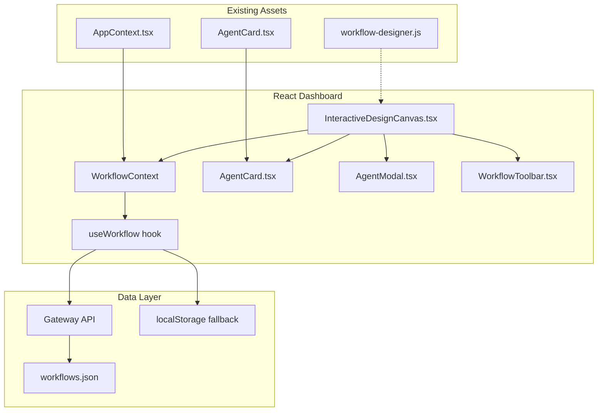
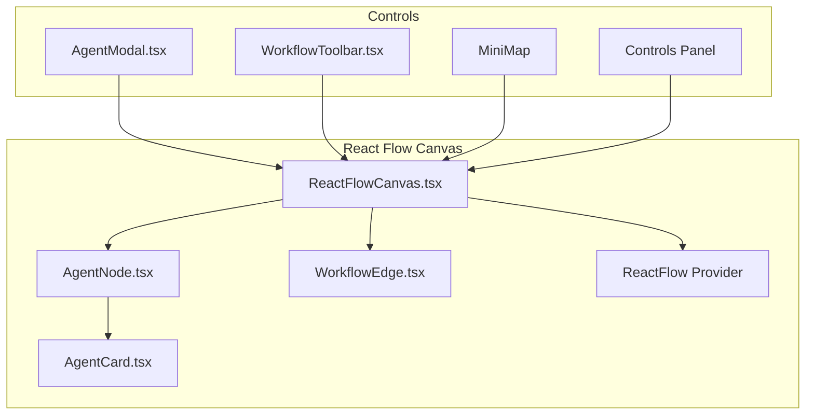

# ADR-006: Interactive Workflow Designer Canvas Architecture

**Status**: Accepted  
**Date**: 2026-03-07  
**Context**: Epic #5 - Interactive Workflow Designer Canvas  
**Stakeholders**: Piyush Jain (Tech Lead), Demo Audiences, Microsoft Foundry Users  

## Context

The current Design Canvas in the React dashboard (`dashboard/src/views/DesignCanvas.tsx`) is completely static, displaying a hardcoded array of 4 agents in a fixed sequential pipeline. Meanwhile, the vanilla JS UI (`ui/workflow-designer.js`) already implements a fully functional interactive workflow designer with complete CRUD operations, drag-to-reorder, save/load persistence, and Push to Pipeline integration.

### Problem Statement
- **Static React Canvas**: Users cannot add, remove, or configure agents in the React dashboard  
- **Working Vanilla Reference**: Full functionality exists in 750-line vanilla JS implementation  
- **Broken AgentOps Story**: Static design stage breaks the "Design → Test → Deploy → Live" narrative  
- **Persistence Gap**: Gateway API has complete workflow CRUD but React components don't use it  

### Research Findings

**Existing Architecture Analysis**:
- `DesignCanvas.tsx`: Static component with hardcoded `AGENTS` array, renders via `AgentCard` mapping  
- `workflow-designer.js`: IIFE module with complete agent CRUD, drag-drop, localStorage + gateway persistence  
- `gateway/src/routes/workflows.ts`: Full REST API (GET/POST/DELETE workflows, activation)  
- `AgentCard.tsx`: Reusable React component with proper TypeScript interfaces  
- `AppContext.tsx`: React context for app state, ready for workflow state extension  

**Technology Landscape Scan**:
- **React Flow (@xyflow/react)**: Industry standard for node-based UIs (35.5K GitHub stars, MIT license, used by Stripe/Zapier)  
- **HTML5 Drag API**: Proven in existing vanilla JS with minimal complexity  
- **Gateway API**: Complete workflow CRUD already implemented, no backend changes needed  
- **File-based JSON**: Established pattern in `data/` directory (audit.json, contracts.json, etc.)  

**Performance Benchmarks**:
- Gateway enforces max 20 agents per workflow (validation in POST route)  
- React Flow handles thousands of nodes efficiently  
- HTML5 drag-drop performs well for <50 interactive elements  
- localStorage + gateway dual persistence provides offline resilience  

**Failure Mode Analysis**:
- **Bundle size**: React Flow adds ~200KB minified; mitigated by tree-shaking  
- **State complexity**: Workflow state in React context; mitigated by proven patterns from vanilla JS  
- **Gateway unavailable**: localStorage fallback proven in vanilla JS implementation  
- **Canvas performance**: React Flow optimized for large node graphs  

## Options

### Option 1: Direct Port with CSS Layout (Recommended)
**Approach**: Port vanilla JS functionality to React using existing AgentCard components and CSS-based sequential layout

**Implementation**:
- Replace static `DesignCanvas.tsx` with interactive version  
- Extract workflow state into React context with useReducer  
- Reuse existing `AgentCard` component, add edit/delete actions  
- Agent modal as separate component with form validation  
- CSS-based layout: sequential (flex row), parallel (grid)  
- HTML5 drag-drop API for reordering (proven in vanilla JS)  
- Dual persistence: gateway API primary, localStorage fallback  

**Pros**:
- [Confidence: HIGH] Minimal complexity, proven patterns from vanilla JS  
- [Confidence: HIGH] Reuses existing React components and gateway API  
- [Confidence: HIGH] No new dependencies, fast implementation  
- [Confidence: HIGH] File-based JSON persistence matches project conventions  

**Cons**:
- [Confidence: MEDIUM] Limited to auto-layout workflows (sequential/parallel only)  
- [Confidence: LOW] No pan/zoom for large workflows  
- [Confidence: LOW] Less visual appeal than node-based canvas  

### Option 2: React Flow Professional Canvas
**Approach**: Build professional node-based canvas using React Flow with custom agent nodes and edge connections

**Implementation**:
- Agent cards as custom React Flow nodes  
- Visual edges showing data flow between agents  
- Built-in pan, zoom, minimap functionality  
- Freeform positioning with auto-layout options  
- Professional UX matching industry tools (n8n, Flowise)  

**Pros**:
- [Confidence: HIGH] Professional visual experience, industry standard  
- [Confidence: HIGH] Scales to complex workflows with pan/zoom  
- [Confidence: MEDIUM] Extensible to conditional branching, loops  

**Cons**:
- [Confidence: HIGH] New dependency (200KB minified)  
- [Confidence: MEDIUM] Higher complexity, longer implementation time  
- [Confidence: MEDIUM] Learning curve for React Flow patterns  

### Option 3: Hybrid Approach  
**Approach**: Start with CSS layout (Option 1), add React Flow in P1 phase

**Implementation**:
- MVP: CSS-based layout with full agent CRUD functionality  
- P1: Migrate to React Flow while preserving all workflows  
- Progressive enhancement without breaking changes  

**Pros**:
- [Confidence: HIGH] Fast MVP delivery, proven CSS patterns  
- [Confidence: MEDIUM] Future upgrade path to professional canvas  
- [Confidence: HIGH] Risk mitigation: fallback to working CSS if React Flow issues  

**Cons**:
- [Confidence: MEDIUM] Two implementation phases, potential rework  
- [Confidence: LOW] Migration complexity from CSS to React Flow layout  

## Decision

**Selected Option**: Option 1 - Direct Port with CSS Layout

**Rationale**:
1. **Priority Alignment**: P0 requirements focus on functional parity with vanilla JS, not visual polish  
2. **Risk Mitigation**: CSS layout is proven in vanilla JS; minimal technical risk for MVP delivery  
3. **Resource Efficiency**: Reuses existing components and gateway API without new dependencies  
4. **Storage Strategy Resolution**: Use file-based JSON persistence in `data/workflows/` matching project conventions  
5. **Future Compatibility**: Design patterns enable future upgrade to React Flow without breaking changes  

**Storage Strategy Decision** (resolves Open Question #2):
- **Primary**: Gateway API with in-memory store for runtime performance  
- **Persistence**: File-based JSON in `data/workflows/` directory for production deployment  
- **Fallback**: localStorage for offline/development scenarios  
- **Pattern**: Matches existing `data/contracts.json`, `data/policies.json` approach  

## Consequences

### Positive
- Fast implementation leveraging existing React components and gateway API  
- Zero new dependencies for MVP, maintaining project stability  
- Established file-based JSON persistence pattern ensures production viability  
- Working vanilla JS provides proven roadmap for all functionality  
- Component architecture enables future React Flow upgrade without breaking changes  

### Negative  
- Limited to auto-layout workflows (sequential, parallel only) for MVP  
- No pan/zoom capability for large workflows  
- CSS drag-drop less polished than React Flow native interactions  

### Migration & Risk Management
- **Gateway Enhancement**: Add file persistence layer to existing in-memory workflows store  
- **Component Isolation**: Design React components as pure functions for easy React Flow migration  
- **State Management**: Use React context + useReducer pattern to centralize workflow state  
- **Fallback Strategy**: localStorage ensures offline functionality during development  
- **Performance Monitoring**: Track canvas render time with >10 agents for optimization decisions  

### Security Considerations
- Workflow definitions contain no PII (only agent configs, tool names, model references)  
- File-based persistence uses JSON serialization (no executable content)  
- Gateway API validates max 20 agents per workflow (DoS prevention)  
- localStorage fallback isolated to browser security context  

**Next Steps**: Create Technical Specification with component architecture, API integration, and implementation phases.