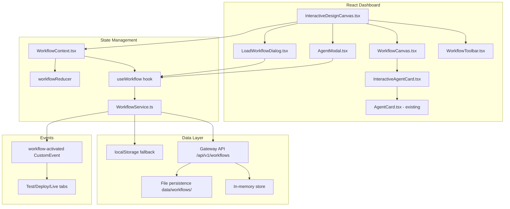
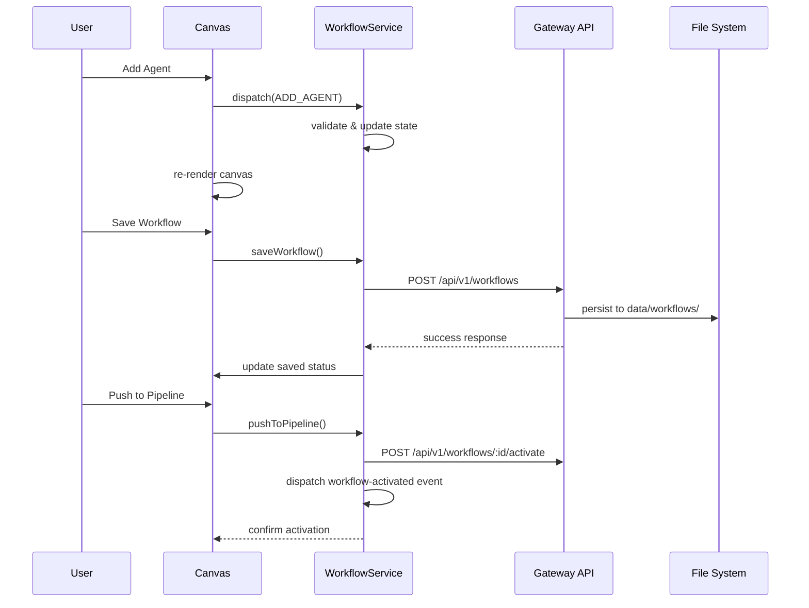

# SPEC-006: Interactive Workflow Designer Canvas Technical Specification

**Status**: Draft  
**Date**: 2026-03-07  
**Epic**: #5 Interactive Workflow Designer Canvas  
**Author**: Solution Architect  
**Stakeholders**: Piyush Jain (Tech Lead), Demo Audiences  
**Related ADR**: [ADR-InteractiveWorkflowDesigner.md](../adr/ADR-InteractiveWorkflowDesigner.md)  

## 1. Overview

Replace the static `DesignCanvas.tsx` component with a fully interactive workflow designer that enables users to add, configure, reorder, and manage agentic workflows through the React dashboard. This implementation ports the proven functionality from `ui/workflow-designer.js` (750 lines) into React components using existing UI patterns and the gateway API.

**Key Capabilities**:
- Agent CRUD operations (add, edit, delete) with comprehensive configuration modal
- Tool association from available MCP servers (8 servers, 21+ tools)  
- Workflow type selection (Sequential, Parallel, Sequential+HITL, Fan-out, Conditional)
- Drag-to-reorder agent execution sequence
- Save/Load workflows with gateway API + localStorage fallback
- Push to Pipeline activation for Test → Deploy → Live progression

**Success Criteria**:
- Complete functional parity with vanilla JS workflow designer
- Seamless integration with existing React dashboard architecture  
- End-to-end workflow activation through AgentOps lifecycle stages

## 2. Goals & Non-Goals

### Goals
- **G1**: Replace static `DesignCanvas.tsx` with interactive workflow designer matching vanilla JS functionality
- **G2**: Enable agent CRUD operations with comprehensive configuration (name, role, tools, model, boundary, output)
- **G3**: Support 5 workflow types with visual layout adaptation (sequential, parallel, HITL, fan-out, conditional)
- **G4**: Implement drag-to-reorder using HTML5 Drag API proven in vanilla JS
- **G5**: Integrate with existing gateway API for workflow persistence and activation
- **G6**: Add file-based JSON persistence in `data/workflows/` for production deployment
- **G7**: Maintain localStorage fallback for offline/development scenarios
- **G8**: Dispatch `workflow-activated` events for Test/Deploy/Live tab updates
- **G9**: Validate workflow structure during authoring, save, and push actions

### Non-Goals
- **NG1**: Visual code editor or agent source code generation
- **NG2**: Custom MCP tool creation (users select from existing 21 tools)
- **NG3**: Real-time multi-user collaboration
- **NG4**: Workflow version history or diff functionality
- **NG5**: Freeform node positioning (auto-layout only for MVP)
- **NG6**: React Flow integration (deferred to P1)

## 3. Architecture



### Component Hierarchy
```
InteractiveDesignCanvas
├── WorkflowToolbar (name, type dropdown, actions)
├── WorkflowCanvas (agent grid with drag-drop)
│   └── InteractiveAgentCard[] (edit/delete actions)
│       └── AgentCard (existing, display only)
├── AgentModal (add/edit agent form)
└── LoadWorkflowDialog (saved workflows list)
```

### State Flow Architecture


## 4. Component Design

### 4.1 InteractiveDesignCanvas.tsx
**Purpose**: Main container replacing static `DesignCanvas.tsx`  
**Dependencies**: WorkflowContext, existing routing/layout

| Props | Type | Description |
|-------|------|-------------|
| None | - | Uses WorkflowContext for all state |

**Responsibilities**:
- Initialize WorkflowContext provider
- Render toolbar, canvas, and modal components  
- Handle keyboard shortcuts (Escape to close modal)
- Manage overall layout and animations

### 4.2 WorkflowToolbar.tsx
**Purpose**: Workflow metadata controls and primary actions

| Props | Type | Description |
|-------|------|-------------|
| workflow | Workflow | Current workflow state |
| onUpdateName | (name: string) => void | Update workflow name |
| onUpdateType | (type: WorkflowType) => void | Change workflow type |
| onSave | () => void | Save workflow |
| onLoad | () => void | Show load dialog |
| onPushToPipeline | () => void | Activate workflow |
| onAddAgent | () => void | Open add agent modal |

**UI Layout**:
```
[Workflow Name Input] [Type Dropdown ⌄] [Add Agent +] [Save] [Load] [Push to Pipeline →]
```

### 4.3 WorkflowCanvas.tsx  
**Purpose**: Agent grid with drag-drop reordering

| Props | Type | Description |
|-------|------|-------------|
| agents | WorkflowAgent[] | Array of workflow agents |
| workflowType | WorkflowType | Layout mode (sequential/parallel) |
| onReorderAgents | (srcId: string, destId: string) => void | Handle drag-drop |

**Layout Modes**:
- **Sequential**: `display: flex; flex-direction: row; gap: 2rem;`
- **Parallel**: `display: grid; grid-template-columns: repeat(auto-fit, minmax(280px, 1fr));`
- **Sequential+HITL**: Sequential with HITL checkpoint indicator after each agent
- **Fan-out**: Grid layout with merge indicator
- **Conditional**: Sequential with branch arrows

### 4.4 InteractiveAgentCard.tsx
**Purpose**: Wrapper around existing `AgentCard` adding edit/delete actions

| Props | Type | Description |
|-------|------|-------------|
| agent | WorkflowAgent | Agent configuration |
| onEdit | (agentId: string) => void | Edit agent handler |
| onDelete | (agentId: string) => void | Delete agent handler |
| isDragging | boolean | Visual drag state |
| ...AgentCardProps | - | Pass-through to AgentCard |

**Action Layout**:
```
┌─ AgentCard ────────────────┐
│ [Edit ✏️] [Delete ✕] [≡ Drag] │
│ (existing AgentCard content) │  
│                           │
└───────────────────────────┘
```

### 4.5 AgentModal.tsx
**Purpose**: Agent configuration form (add/edit)

| Props | Type | Description |
|-------|------|-------------|
| agent | WorkflowAgent \| null | Agent to edit (null for add) |
| isOpen | boolean | Modal visibility |
| onSave | (agent: WorkflowAgent) => void | Save handler |
| onClose | () => void | Close modal handler |

**Form Fields**:
| Field | Type | Validation | Default |
|-------|------|------------|---------|
| name | text | Required, 1-100 chars | "" |
| icon | text | Required, 1-2 chars | First char of name |
| role | textarea | Required, 1-500 chars | "" |
| model | select | Required, from MODEL_OPTIONS | "GPT-4o" |
| tools | checkboxes | Optional, grouped by server | [] |
| boundary | text | Optional, 0-200 chars | "" |
| output | text | Optional, 0-200 chars | "" |
| color | swatches | Required, from AGENT_COLORS | Auto-assigned |

### 4.6 LoadWorkflowDialog.tsx
**Purpose**: Saved workflows management

| Props | Type | Description |
|-------|------|-------------|
| isOpen | boolean | Dialog visibility |
| workflows | Workflow[] | Available workflows |
| onLoad | (workflowId: string) => void | Load workflow |
| onDelete | (workflowId: string) => void | Delete workflow |
| onClose | () => void | Close dialog |

**List Item Layout**:
```
┌─ workflow-item ───────────────────────┐
│ Workflow Name                    [✕]  │
│ 4 agents • Sequential • Updated 2 days ago │
└───────────────────────────────────────┘
```

## 5. Data Model

### 5.1 Workflow Interface
```typescript
interface Workflow {
  id: string;                    // "wf-12345abc" 
  name: string;                  // "Contract Processing Pipeline"
  type: WorkflowType;            // "sequential" | "parallel" | etc.
  agents: WorkflowAgent[];       // Agent configurations
  active?: boolean;              // Currently active for pipeline
  createdAt: string;            // ISO 8601 timestamp
  updatedAt: string;            // ISO 8601 timestamp
}

type WorkflowType = 
  | "sequential"                 // Agents execute one after another
  | "parallel"                   // Agents execute simultaneously  
  | "sequential-hitl"            // Sequential with human checkpoints
  | "fan-out"                    // One agent fans to parallel then merges
  | "conditional";               // Routing based on agent outputs
```

### 5.2 WorkflowAgent Interface
```typescript
interface WorkflowAgent {
  id: string;                    // "agent-1", "agent-2" 
  name: string;                  // "Intake Agent"
  role: string;                  // "Classify contracts by type and extract metadata"
  icon: string;                  // "I", "📄", "🔍" (1-2 chars)
  model: string;                 // "GPT-4o", "GPT-4.1", "o3-mini"
  tools: string[];               // ["upload_contract", "classify_document"]
  boundary: string;              // "Classify only" (constraint description)
  output: string;                // "Classification and metadata" (output description)
  color: string;                 // "#3B82F6" (hex color for visual distinction)
  order: number;                 // 0, 1, 2 (execution sequence)
}
```

### 5.3 Constants
```typescript
// Available models from Microsoft Foundry
const MODEL_OPTIONS = [
  "GPT-4o", "GPT-4o-mini", "GPT-4.1", "GPT-4.1-mini", 
  "GPT-4.1-nano", "o3-mini", "o4-mini"
];

// Agent color palette for visual distinction  
const AGENT_COLORS = [
  "#3B82F6", "#EF4444", "#10B981", "#F59E0B", 
  "#8B5CF6", "#06B6D4", "#84CC16", "#F97316",
  "#EC4899", "#6B7280", "#14B8A6", "#F43F5E"
];

// MCP tool registry (from existing servers)
const AVAILABLE_TOOLS = {
  "contract-intake-mcp": ["upload_contract", "classify_document", "extract_metadata"],
  "contract-extraction-mcp": ["extract_clauses", "identify_parties", "extract_dates_values"],
  "contract-compliance-mcp": ["check_policy", "flag_risk", "get_policy_rules"],
  "contract-workflow-mcp": ["route_approval", "escalate_to_human", "notify_stakeholder"],
  "contract-audit-mcp": ["get_audit_log", "create_audit_entry"],
  "contract-eval-mcp": ["run_evaluation", "get_baseline"],
  "contract-drift-mcp": ["detect_drift", "model_swap_analysis"],
  "contract-feedback-mcp": ["submit_feedback", "optimize_feedback"]
};
```

## 6. API Design

### 6.1 Gateway API Integration
**Base URL**: `http://localhost:8000/api/v1/workflows`

| Method | Endpoint | Purpose | Request | Response |
|--------|----------|---------|---------|----------|
| GET | `/workflows` | List all saved workflows | - | `{workflows: Workflow[], active_workflow_id: string}` |
| GET | `/workflows/active` | Get currently active workflow | - | `Workflow` |
| GET | `/workflows/:id` | Get specific workflow | - | `Workflow` |
| POST | `/workflows` | Save/update workflow | `Workflow` | `Workflow` |
| POST | `/workflows/:id/activate` | Set active workflow | - | `{message: string, workflow: Workflow}` |
| DELETE | `/workflows/:id` | Delete workflow | - | `{message: string}` |

### 6.2 WorkflowService API
```typescript
class WorkflowService {
  // Workflow CRUD
  async saveWorkflow(workflow: Workflow): Promise<Workflow>;
  async loadWorkflows(): Promise<Workflow[]>;
  async loadWorkflow(id: string): Promise<Workflow>;
  async deleteWorkflow(id: string): Promise<void>;
  
  // Pipeline integration
  async activateWorkflow(id: string): Promise<void>;
  
  // Storage fallback
  saveToLocalStorage(workflow: Workflow): void;
  loadFromLocalStorage(): Workflow[];
  
  // Event dispatch
  dispatchWorkflowActivated(workflow: Workflow): void;
}
```

### 6.3 File Persistence API
**Location**: `data/workflows/`
**Format**: JSON files named by workflow ID

```typescript
// File: data/workflows/wf-12345abc.json
{
  "id": "wf-12345abc",
  "name": "Contract Processing Pipeline",
  "type": "sequential",
  "agents": [/* WorkflowAgent array */],
  "createdAt": "2026-03-07T19:22:00.000Z",
  "updatedAt": "2026-03-07T19:22:00.000Z"
}
```

**Gateway Implementation Enhancement**:
```typescript
// Add to workflows.ts - file persistence layer
import { readdir, readFile, writeFile } from 'fs/promises';
import { join } from 'path';

const WORKFLOWS_DIR = join(process.cwd(), 'data', 'workflows');

async function loadWorkflowsFromDisk(): Promise<Workflow[]> {
  // Implementation to load JSON files from data/workflows/
}

async function saveWorkflowToDisk(workflow: Workflow): Promise<void> {
  // Implementation to save JSON file to data/workflows/
}
```

## 7. Security

### 7.1 Input Validation
| Component | Validation Rules | Error Handling |
|-----------|------------------|----------------|
| Agent Name | Required, 1-100 chars, no HTML | Show inline error, prevent save |
| Agent Role | Required, 1-500 chars, no HTML | Show inline error, prevent save |
| Agent Icon | Required, 1-2 chars, Unicode safe | Show inline error, prevent save |
| Tools Selection | Optional, validate against AVAILABLE_TOOLS | Filter invalid tools silently |
| Workflow Name | Required, 1-200 chars, no HTML | Show inline error, prevent save |

### 7.2 Data Protection
- **No PII in workflows**: Agent configs contain only metadata, tool names, model references
- **JSON serialization only**: No executable content in workflow definitions  
- **XSS prevention**: HTML escape all user input before rendering
- **File path validation**: Workflow IDs sanitized for safe file names
- **Storage isolation**: localStorage scoped to dashboard origin

### 7.3 API Security
- **Rate limiting**: Gateway enforces max 20 agents per workflow
- **Request validation**: JSON schema validation on POST endpoints
- **CORS configuration**: Restrict API access to dashboard domain
- **Error sanitization**: No internal paths in error responses

## 8. Performance

### 8.1 Performance Targets
| Metric | Target | Measurement |
|--------|--------|-------------|
| Canvas render time | <100ms for 10 agents | React DevTools Profiler |
| Agent modal open time | <50ms | Time to interactive |
| Drag operation latency | <16ms (60fps) | requestAnimationFrame timing |
| Workflow save latency | <500ms | API response time |
| localStorage operations | <10ms | Performance.now() timing |

### 8.2 Optimization Strategies
- **Component memoization**: `React.memo()` for AgentCard components
- **State updates batching**: Group multiple agent updates in single render
- **Drag state optimization**: Throttle drag events to 60fps
- **JSON persistence**: Debounce auto-save to localStorage (500ms)
- **Gateway caching**: Cache workflow list in memory for 30 seconds

### 8.3 Monitoring & Alerts
```typescript
// Performance monitoring hooks
function usePerformanceMonitoring() {
  const measureRenderTime = (componentName: string) => {
    // Implementation using Performance API
  };
  
  const measureAPILatency = (endpoint: string) => {
    // Implementation for API call timing  
  };
}
```

## 9. Error Handling

### 9.1 Error Categories & Recovery
| Error Type | Scenario | Recovery Strategy | User Experience |
|------------|----------|-------------------|-----------------|
| **Validation** | Invalid agent name/role | Show inline errors, prevent save | Red border + error text below field |
| **Network** | Gateway API unavailable | Fall back to localStorage | Toast: "Saved locally - will sync when connection restored" |
| **State** | Corrupted workflow data | Reset to default workflow | Toast: "Workflow reset due to data corruption" |
| **Storage** | localStorage quota exceeded | Clear old workflows | Dialog: "Storage full - remove old workflows?" |
| **Drag** | Drop target invalid | Revert to original position | Visual feedback: invalid drop zone |

### 9.2 Error Boundaries
```typescript
// Workflow-specific error boundary
class WorkflowErrorBoundary extends Component {
  state = { hasError: false, error: null };
  
  static getDerivedStateFromError(error: Error) {
    return { hasError: true, error };
  }
  
  componentDidCatch(error: Error, errorInfo: ErrorInfo) {
    // Log to monitoring service
    console.error('Workflow component error:', error, errorInfo);
  }
  
  render() {
    if (this.state.hasError) {
      return <WorkflowErrorFallback onReset={() => this.setState({ hasError: false })} />;
    }
    return this.props.children;
  }
}
```

### 9.3 Graceful Degradation
- **Gateway offline**: Full functionality via localStorage
- **JavaScript disabled**: Static canvas fallback (existing behavior)
- **Drag API unsupported**: Arrow buttons for reordering
- **localStorage unavailable**: Session-only workflow storage

## 10. Monitoring

### 10.1 Metrics Collection
| Metric | Purpose | Collection Method | Alert Threshold |
|--------|---------|-------------------|-----------------|
| Workflow creation rate | Feature adoption | Custom event tracking | < 1 per day |
| Agent CRUD operations | User engagement | Action counters | Error rate > 5% |
| Save/load success rate | Data persistence health | API response tracking | Success rate < 95% |
| Canvas render performance | UI responsiveness | Performance API | Render time > 200ms |
| Push to Pipeline success | End-to-end workflow | Event listener | Failure rate > 2% |

### 10.2 Dashboard Integration
```typescript
// Analytics tracking
const useWorkflowAnalytics = () => {
  const trackEvent = (event: string, properties: Record<string, any>) => {
    // Integration with existing analytics
    window.analytics?.track(event, properties);
  };
  
  const trackWorkflowCreated = (workflow: Workflow) => {
    trackEvent('workflow_created', {
      workflow_id: workflow.id,
      agent_count: workflow.agents.length,
      workflow_type: workflow.type,
      tools_used: workflow.agents.flatMap(a => a.tools).length
    });
  };
};
```

### 10.3 Health Checks
- **Gateway connectivity**: Ping `/api/v1/workflows` every 30 seconds
- **Storage availability**: Test localStorage write on app init
- **Component render errors**: Error boundary reporting
- **Performance degradation**: Track render times over 95th percentile

## 11. Testing Strategy

### 11.1 Unit Tests
| Component | Test Coverage | Key Scenarios |
|-----------|---------------|---------------|
| `workflowReducer` | 95% | ADD_AGENT, EDIT_AGENT, REMOVE_AGENT, REORDER_AGENTS, SET_WORKFLOW_TYPE |
| `WorkflowService` | 90% | Save/load operations, localStorage fallback, error handling |
| `AgentModal` | 85% | Form validation, tool selection, color picker |
| `WorkflowCanvas` | 80% | Drag-drop operations, layout rendering |

```typescript
// Example test suite
describe('workflowReducer', () => {
  it('should add agent with auto-generated order', () => {
    const state = { agents: [mockAgent1], nextId: 2 };
    const action = { type: 'ADD_AGENT', payload: mockAgent2 };
    const result = workflowReducer(state, action);
    
    expect(result.agents).toHaveLength(2);
    expect(result.agents[1].order).toBe(1);
  });
  
  it('should reorder agents on drag-drop', () => {
    // Test implementation
  });
});
```

### 11.2 Integration Tests
- **Gateway API integration**: Test all CRUD operations with mock server
- **localStorage fallback**: Test offline mode behavior
- **Event dispatch**: Verify `workflow-activated` events reach other components
- **End-to-end workflow**: Create → Edit → Save → Load → Activate full cycle

### 11.3 UI Tests
```typescript
// React Testing Library examples
describe('InteractiveDesignCanvas', () => {
  it('should open agent modal on Add Agent click', () => {
    render(<InteractiveDesignCanvas />);
    fireEvent.click(screen.getByText('Add Agent'));
    expect(screen.getByRole('dialog')).toBeInTheDocument();
  });
  
  it('should save workflow and show toast', async () => {
    // Test implementation with mock API
  });
});
```

## 12. Migration Plan

### 12.1 Implementation Phases

#### Phase 1: Component Architecture (Week 1)
- Create `WorkflowContext` and `workflowReducer`
- Implement `AgentModal` component with form validation
- Build `InteractiveAgentCard` wrapper around existing `AgentCard`
- Add `WorkflowToolbar` for workflow metadata and actions

#### Phase 2: Canvas Functionality (Week 2)  
- Implement `WorkflowCanvas` with CSS-based layouts
- Add HTML5 drag-drop for agent reordering (port from vanilla JS)
- Integrate with `WorkflowService` for save/load operations
- Add `LoadWorkflowDialog` for workflow management

#### Phase 3: Gateway Integration (Week 3)
- Enhance gateway API with file persistence layer
- Implement localStorage fallback in `WorkflowService`
- Add Push to Pipeline functionality with event dispatch
- Test end-to-end workflow activation

#### Phase 4: Polish & Testing (Week 4)
- Add error boundaries and graceful degradation
- Implement performance monitoring and analytics
- Complete test suite (unit + integration tests)
- Documentation and deployment preparation

### 12.2 Migration Strategy
1. **Preserve existing**: Keep `DesignCanvas.tsx` as `StaticDesignCanvas.tsx` backup
2. **Feature flag**: Use `useAppContext` to toggle between static/interactive modes
3. **Gradual rollout**: Enable interactive mode after Phase 3 completion
4. **Data migration**: Import any existing workflow data from localStorage

### 12.3 Rollback Plan
- **Component isolation**: `InteractiveDesignCanvas` as drop-in replacement for `DesignCanvas`  
- **Feature toggle**: Single line change to revert to static mode
- **No breaking changes**: Gateway API remains backward compatible
- **Data preservation**: Workflows saved in both formats during transition

## 13. Open Questions

| # | Question | Owner | Priority | Decision Date |
|---|----------|-------|----------|---------------|
| 1 | Should workflow export include agent prompt templates or just metadata? | PM | P2 | TBD |
| 2 | Do we need workflow template gallery with pre-built patterns? | UX | P2 | TBD |  
| 3 | Should agents support custom icons (upload) or text-only? | UX | P2 | TBD |
| 4 | File persistence: single workflows.json or individual files per workflow? | Tech Lead | P1 | **Individual files for better performance and conflict resolution** |
| 5 | Should localStorage cache include workflow thumbnails for quick preview? | PM | P2 | TBD |

---

## Implementation Checklist

### Ready for Development
- [x] ADR approved with storage strategy decision
- [x] Component architecture defined with clear interfaces
- [x] Data model and API contracts specified
- [x] Performance targets and monitoring plan established
- [x] Migration phases with rollback strategy documented

### Pre-Implementation Tasks
- [ ] Create feature flag in `AppContext` for interactive mode toggle
- [ ] Set up `data/workflows/` directory structure
- [ ] Review existing `AgentCard.tsx` interface for extension needs
- [ ] Confirm gateway API enhancement scope with backend team

**Estimated Implementation Time**: 4 weeks  
**Dependencies**: None (all required APIs and components exist)  
**Risk Level**: Low (proven vanilla JS patterns, existing API/components)