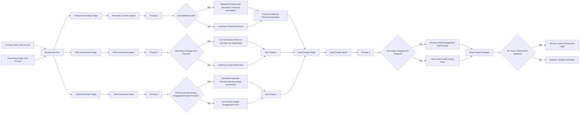

# PFX Audit Workflow Mapping Brief

## Purpose

This brief translates the pasted whiteboard into a structured workflow view for audit-related AI-assisted content generation. It consolidates four outputs into one document:

1. Current vs proposed workflow comparison
2. Formal workflow stage matrix
3. Mapping to a real audit engagement lifecycle
4. Mermaid flowchart for documentation or presentation use

## Scope Note

The whiteboard appears to describe workflow additions to an AI-assisted audit planning and design process, not a full end-to-end financial statement audit execution model.

The strongest coverage appears to be in:

- Research and public-information gathering
- Client understanding
- Financial summary generation
- Risk assessment generation
- Audit design generation

The board does not appear to cover:

- Control testing
- Substantive testing
- Completion procedures
- Audit opinion issuance

## Interpretation Note

Some sticky-note text in the image is partially unreadable. This document uses the clearly visible labels and repeated workflow patterns across the board. Where the image is ambiguous, the mapping below reflects the most likely interpretation rather than a confirmed requirement.

## Current Vs Proposed Workflow

| Area | Current Workflow | Proposed Workflow Addition | AI Agent Mentioned | Prompt Pattern | Main Change |
|---|---|---|---|---|---|
| Research / public info | One researcher run, mostly tied to a single engagement context | Research separately at primary engagement level and secondary engagement level | No explicit named AI agent visible; this looks like a research workflow step | Add 2 prompts: primary public info, secondary public info | Expand research coverage before downstream summarization |
| Client summary | Existing summary appears primarily single-engagement oriented | Add separate treatment for primary and secondary engagement context, then join results | Client Summary Agent | Prompt 4, with notes implying 2 prompt targets and joined output | Make client summary engagement-aware across both levels |
| Financial summary | Current workflow likely produces one financial summary stream | Add primary and secondary engagement handling, especially for consolidated cases | Financial Summary Agent | Prompt 2 | Add conditional logic for consolidated true/false and separate financial handling |
| Risk assessment | Current risk output likely centered on one engagement context | Separate risk and financial information for secondary engagements from primary | Risk Assessment Agent | Prompt 3 | Preserve dual-engagement visibility in risk outputs |
| Audit design | Existing design flow appears downstream of risk and financial summaries | Extend audit design to use dual-engagement structured inputs | Audit Design Agent | Prompt 3 | Push dual-engagement logic into final design output |
| Output format | Likely one existing output schema or format | Reconfirm how combined output should be structured | Multiple downstream AI agents affected | Output joining pattern repeated | Need format confirmation before implementation |
| Consolidation handling | Implicit or incomplete | Explicit branch for consolidated vs non-consolidated cases | Financial Summary Agent, Risk Assessment Agent, Audit Design Agent | Conditional prompt or workflow logic | Add branching behavior instead of one universal flow |

## Summary Interpretation

The board is not redesigning the full audit lifecycle. It is extending an AI-assisted audit content workflow so it can handle:

- Primary engagement
- Secondary engagement
- Consolidated vs non-consolidated scenarios
- Joined outputs from multiple prompts

## Formal Workflow Matrix

| Stage | Inputs | AI Agent Mentioned | Prompt | Logic | Output |
|---|---|---|---|---|---|
| 1. Researcher Run | Client, primary engagement, secondary engagement, public sources | No explicit AI agent named | New primary public-info prompt; new secondary public-info prompt | Search public information separately at both engagement levels | Research output package for downstream stages |
| 2. Client Summary | Client, engagement structure, research outputs, consolidated indicator | Client Summary Agent | Prompt 4 | If both primary and secondary exist, generate both views and join outputs; naming convention for lower-level entity may change | Combined client summary |
| 3. Financial Summary | Client, financial data, primary engagement, secondary engagement, consolidated flag | Financial Summary Agent | Prompt 2 | Branch on consolidated true/false; if relevant, separate primary and secondary financial content | Financial summary with dual-engagement structure |
| 4. Risk Assessment | Client, financial summary, research findings, primary and secondary engagement context | Risk Assessment Agent | Prompt 3 | Financial and risk information for secondary engagements should be listed separately from primary | Risk assessment output with separated sections |
| 5. Audit Design | Client, financial summary, risk assessment, engagement structure | Audit Design Agent | Prompt 3 | Carry primary and secondary separation into design recommendations; if no secondary engagement, continue current flow | Audit design output |
| 6. Output Assembly | Outputs from client, financial, risk, and design stages | Affected across all downstream AI agents | Joined-output pattern | Merge outputs from multiple prompts into one consumer-facing result | Final structured package |
| 7. Review / Governance | All produced outputs plus formatting expectations | No specific AI agent visible; human review point | N/A | Confirm with EA team on final output format and workflow behavior | Approved workflow design or required revisions |

## Mapping To A Real Audit Engagement Lifecycle

| Real Audit Lifecycle Stage | What Happens In Real Audit Work | Board Coverage | AI Agent Mentioned | Fit Assessment |
|---|---|---|---|---|
| Acceptance / continuance | Decide whether to take or retain client | Not covered | None | Outside scope |
| Kickoff / planning | Define scope, timeline, team responsibilities | Partially covered through engagement structure references | None explicitly | Indirectly covered |
| Entity and engagement understanding | Understand client, business, legal structure, reporting context | Covered strongly | Client Summary Agent | Strong fit |
| Public information / background research | Gather external context, market or company information | Covered strongly | No named AI agent visible; research stage only | Strong fit |
| Financial understanding | Review financial profile, balances, trends, and structure | Covered strongly | Financial Summary Agent | Strong fit |
| Risk assessment | Identify engagement and audit risks | Covered strongly | Risk Assessment Agent | Strong fit |
| Audit response design | Translate risks into audit approach or design | Covered strongly | Audit Design Agent | Strong fit |
| Controls testing | Test operating effectiveness of controls | Not covered in the board | None | Outside current scope |
| Substantive testing | Execute audit testing over balances and transactions | Not covered in the board | None | Outside current scope |
| Completion and reporting | Final conclusion, opinion, governance communication | Not covered directly | None | Outside current scope |

## Lifecycle Interpretation

The board maps mainly to the early and middle planning phases of an audit engagement:

- Understanding the client
- Understanding the financial context
- Assessing risks
- Designing the audit response

It does not yet cover the execution-heavy phases:

- Control testing
- Substantive testing
- Completion
- Opinion issuance

## AI Agent Inventory From The Board

| AI Agent | Role In Workflow | Prompt Count Shown | Main Inputs | Main Outputs | Notes |
|---|---|---|---|---|---|
| Client Summary Agent | Build engagement-aware client summary | 4 | Client, primary engagement, secondary engagement, likely research context | Client summary | Board suggests output joining behavior |
| Financial Summary Agent | Build financial summary for dual-engagement context | 2 | Client, financial data, primary and secondary engagement, consolidated flag | Financial summary | Explicit consolidated logic appears here |
| Risk Assessment Agent | Generate risk-oriented assessment with separated primary and secondary content | 3 | Client, engagement info, financial and risk data | Risk assessment | Secondary content should remain distinct |
| Audit Design Agent | Produce audit design output from prior stages | 3 | Client, engagement context, risk and financial inputs | Audit design output | Downstream design stage |
| Researcher Run | Research support stage, not explicitly shown as a named AI agent | Not shown as an agent | Public sources, engagement context | Research outputs | Appears upstream of all named agents |

## Main Workflow Logic Rules Visible On The Board

| Logic Rule | Meaning |
|---|---|
| Primary and secondary engagement handled separately | The workflow should not collapse the two engagement contexts into one input stream |
| Joined outputs | Multiple prompts may generate separate outputs that are later merged |
| Consolidated true / false branch | Some workflow behavior depends on whether the request is for a consolidated audit context |
| Secondary information listed separately | Risk and financial details for the secondary engagement should not be blended invisibly into primary |
| Fallback to current execution | If no secondary engagement exists, keep the current flow rather than forcing a second branch |
| Output format confirmation required | Final structure still needs agreement with the EA team |

## End-To-End Interpretation

If rewritten into a simple operational sequence, the board appears to describe the following:

1. Run researcher or public-info retrieval for primary and possibly secondary engagement.
2. Feed that into Client Summary Agent.
3. Feed engagement-aware financial data into Financial Summary Agent.
4. Feed separated financial and risk context into Risk Assessment Agent.
5. Feed combined or separated outputs into Audit Design Agent.
6. Apply consolidated or non-consolidated logic throughout.
7. Confirm final output structure with the EA team.

## Mermaid Flowchart

## Recommended Packaging For A Formal Workflow Note

### Objective

Extend the audit planning workflow to support primary and secondary engagement handling.

### In Scope

- Research
- Client summary
- Financial summary
- Risk assessment
- Audit design

### Out Of Scope

- Controls testing
- Substantive testing
- Final reporting
- Audit opinion issuance

### AI Agents Involved

- Client Summary Agent
- Financial Summary Agent
- Risk Assessment Agent
- Audit Design Agent

### Core Logic

- Dual engagement separation
- Consolidated branching
- Output joining
- Human format confirmation

## Conclusion

The board describes a planning-and-design augmentation layer for an AI-assisted audit workflow, not an end-to-end audit execution model. The strongest coverage is in:

- Engagement understanding
- Public-info gathering
- Financial summarization
- Risk assessment
- Audit design

The missing downstream coverage is:

- Fieldwork execution
- Control testing
- Substantive testing
- Completion and reporting